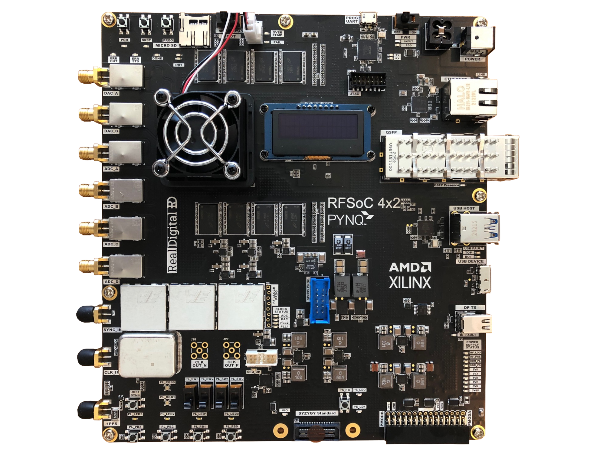

# RFSoC 4x2 Kit
This repository contains the source code and build scripts for the RFSoC 4x2 base design and image. The design files in this repository are compatible with Xilinx Vivado 2020.2, and PYNQ v2.7.0 and later.

## Getting started

Visit the [RFSoC and PYNQ webpage](https://www.rfsoc-pynq.io/) to find out how to set up your board with a PYNQ image and explore all its features.

<p align="center">
  
</p>

## Image rebuilding steps

For image rebuilding you will need a Linux (Ubuntu 18.04/20.04) host machine, with Vivado and Petalinux 2020.2 installed. For more host setup instructions please see the PYNQ [sdbuild readme](https://github.com/Xilinx/PYNQ/tree/master/sdbuild).

1. Clone this repository
	
	```bash
	git clone --recursive https://github.com/Xilinx/RFSoC4x2-PYNQ.git
	```
2. To rebuild just the base overlay, run
	
	```
	make base
	```
3. To rebuild the SD card image, run
	
	```
	make image
	```
---
Copyright (C) 2022 Xilinx, Inc

SPDX-License-Identifier: BSD-3-Clause

