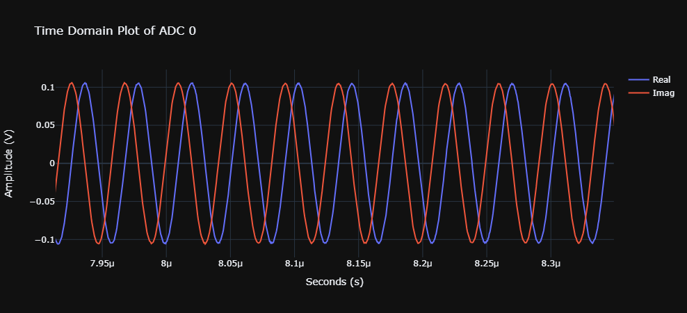
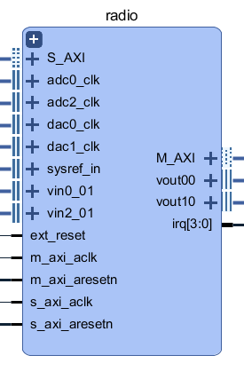

# RF System Package

This package contains a hierarchical radio block design for PYNQ on 
RFSoC. The purpose of this hierarchy is to provide the user visualisation
capabilities for the RFSoC's DataConverters (RF-DCs). The RF-DC core already
has its own driver (`xrfdc`), which this design uses.
The image below demonstrates the visualisation capabilities of the hierarchical
radio block design.



Integrating the hierarchical block into your own design is relatively
straight forward. See the image below showing the `rfsystem` with input 
and output ports.


  
The `rfsystem` software package can be added through pip installation. 
This will install the package to your system.

```
pip3 install .
```

---
Copyright (C) 2022 Xilinx, Inc

SPDX-License-Identifier: BSD-3-Clause
