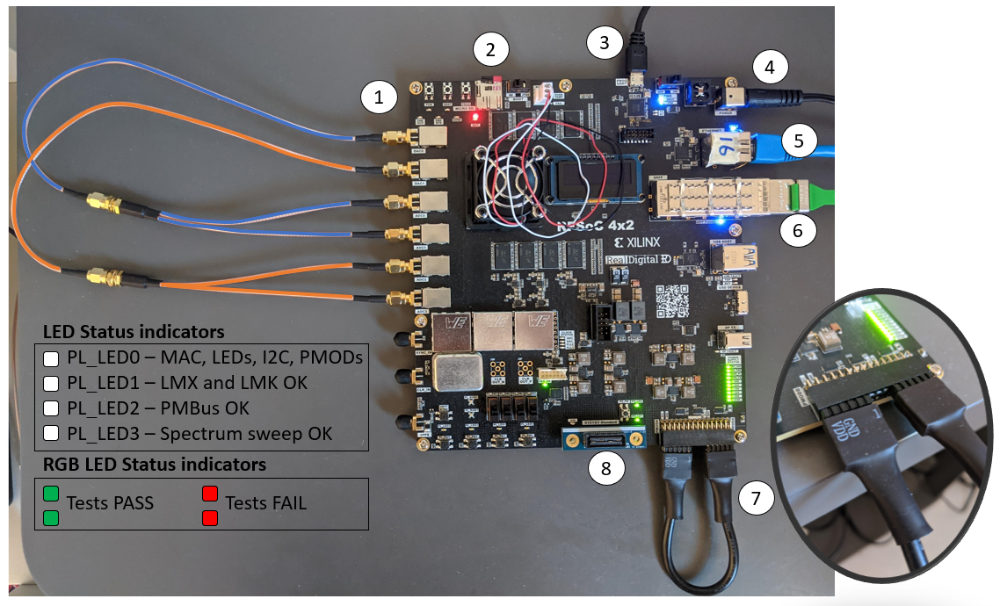

# RFSoC4x2 Self-test Package

This package implements a simple Python script to test the RFSoC4x2 board.
If this package has been added, when you boot up the RFSoC4x2 board,
the board will enter automatic testing mode and test multiple components.
The test will finish after around 90 seconds. Test logs will be shown
on your serial terminal, and they will also be saved into the boot partition
of your SD card.

## Add Self-test Package

Users can choose to either add this package manually, or add this package
automatically during PYNQ SD build flow.

To add it manually, in the boot partition of your SD card, just replace the
original `boot.py` file with the one listed in this package. You can also
leverage the following script (under `su`).

```bash
cd /boot
cp -f boot.py boot.py.old
curl -o boot.py \
https://raw.githubusercontent.com/Xilinx/RFSoC4x2-PYNQ/master/board/RFSoC4x2/packages/selftest/boot.py
reboot
```

To add it into SD build flow, modify the `RFSoC4x2.spec` file to include it.
It is recommended to add it to the very end of the `RFSoC4x2.spec` file, 
since this `boot.py` will overwrite all the previous changes in your `boot.py`.

## Board Connection

To use this package, please use the following steps:



1. Connect an SMA loopback as shown in the above picture:
	* RF-DAC A -> female to 2 male splitter -> RF-ADCs A,B
	* RF-DAC B -> female to 2 male splitter -> RF-ADCs C,D

2. Plug in the SD card (which has the image burned onto it) into the slot.
3. (optional) connect serial port to your PC, if you want to check some
   debugging message on your serial terminal.
4. Connect the power barrel.
5. Connect the Ethernet cable.
6. Connect CMAC loopback module.
7. Connect PMOD loopback cable
8. Connect the SYZYGY loopback module.

## Components Tested

The following components will be tested in order:

1. Serial terminal is initialized and tested if connected.
2. PL_LED0 will be turned on if:
	* MAC address is valid.
	* LEDs can be configured.
	* I2C bus can be initialized.
	* PMODs can write/read GPIO
	* SYZYGY can be enabled.
	* Power Management bus (PMBus) can be detected.
3. PL_LED1 will be turned on if:
	* LMX and LMK clock chips can be programmed.
4. PL_LED2 will be turned on if:
	* PMBus functions properly during spectrum sweep. 
5. PL_LED3 will be turned on if:
	* RF components work properly during spectrum sweep.
6. PL DRAM

If all the components work fine, both RGB LEDs (PL_RGB0 and PL_RGB1) will be green.
Otherwise they will both be red, indicating a failed test. You will also
see 'TEST PASS' or 'TEST FAIL' on the OLED display and your terminal.

----
Copyright (C) 2022 Xilinx, Inc
SPDX-License-Identifier: BSD-3-Clause
