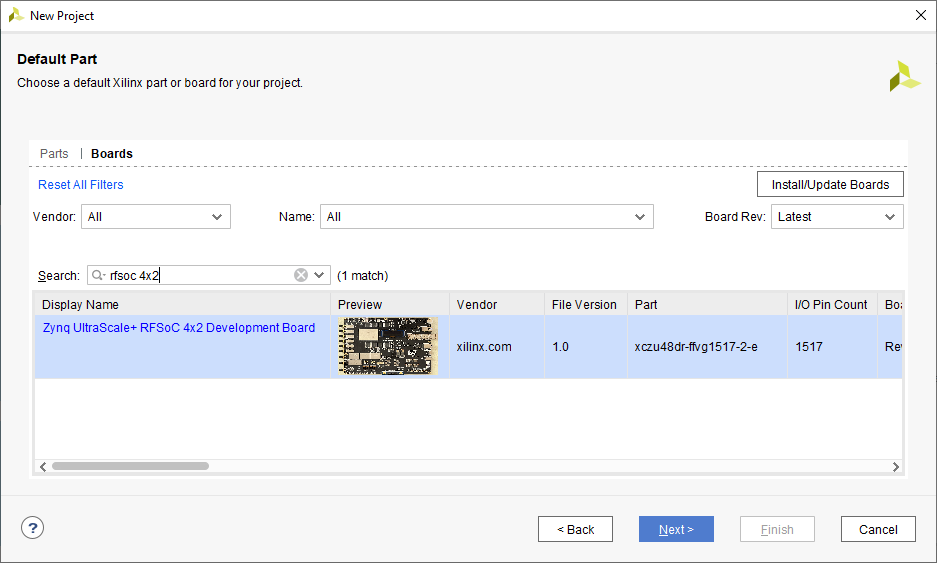

# RFSoC 4x2 Board Files and BSP

The RFSoC 4x2 board files can be found on the Xilinx *Board Store*

[https://github.com/Xilinx/XilinxBoardStore/tree/2020.1/boards/Xilinx/rfsoc4x2/](https://github.com/Xilinx/XilinxBoardStore/tree/2020.1/boards/Xilinx/rfsoc4x2/)

## Install the board files 

You can install the board files from the Vivado Tcl prompt with the following commands:

```
xhub::refresh_catalog [xhub::get_xstores xilinx_board_store]
xhub::install [xhub::get_xitems xilinx.com:xilinx_board_store:rfsoc4x2:1.0]
```

If Vivado is open you you need to restart it before you create a new project. 

## Create a new Project

The next time you create a *New Project*, you will have an option to select the RFSoC 4x2 board as shown below.




# RFSoC 4x2 BSP 

The BSP (Board Support Project) files can be found on the RealDigital GitHub repository:

* https://github.com/RealDigitalOrg/RFSoC4x2-BSP