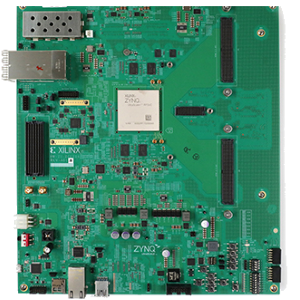
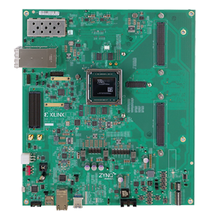

# Other RFSoC boards

PYNQ and RFSoC-PYNQ are open source. If an RFSoC-PYNQ image isn't available for your RFSoC board, you can build your own. 

## Custom RFSoC-PYNQ image

To build your own custom RFSoC-PYNQ image it is recommneded that you follow the [instructions for the ZCU216 RFSoC-PYNQ image build](https://github.com/sarafs1926/ZCU216-PYNQ).

You can find more information on building a PYNQ image and ask questions on the [PYNQ support forum: quick porting of PYNQ](https://discuss.pynq.io/t/quick-porting-of-pynq-using-pre-built-images/1075/16).

## Community boards and future support

RFSoC-PYNQ images have been created by PYNQ community members for other RFSoC boards:

* [ZCU216 GitHub repository](https://github.com/sarafs1926/ZCU216-PYNQ), credit: [Sara Sussman](https://sarafs1926.github.io/)
* *ZCU208 Coming soon*

<html>
<table style="background-color: #FFFFFF;">
  <tr>
    <th>ZCU216</th>
    <th>ZCU208 (coming soon)</th>
  </tr>
  <tr>
    <td></td>
    <td></td>
  </tr>

  <!--<tr>
    <td><a href="https://bit.ly/rfsoc2x2_2_7">PYNQ image</a></td>
    <td><a href="">PYNQ image</a></td>
    <td><a href="https://bit.ly/zcu111_2_7">PYNQ image</a></td>
  </tr>-->

  <!--<tr>
    <td><a href="./rfsoc_2x2_overview.html">Board Overview</a></td>
    <td><a href="./rfsoc_4x2_overview.html">Board Overview</a></td>
    <td><a href="https://www.xilinx.com/products/boards-and-kits/zcu111.html">ZCU111 webpage</a></td>
  </tr>-->
  
</table>
</html>

