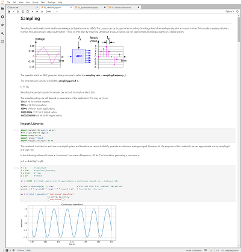

# Educational Resources

The following educational material to support the Zynq RFSoC, and the RFSoC4x2 has been developed by the University of Strathclyde in partnership with Xilinx. 

## RFSoC Introduction Notebooks

There are a collection of RFSoC introductory notebooks specifically for your RFSoC4x2 development board. The RFSoC notebooks consist of the following topics:

* An Introduction to RFSoC
* The RF Data Converters
* Software Defined Radio and the RFSoC

You can obtain a copy of the RFSoC introductory notebooks from the following GitHub repository, [RFSoC Notebooks](https://github.com/strath-sdr/rfsoc_notebooks).

## Digital Signal Processing Notebooks

Additional material has been developed by the University of Strathclyde to support teaching of fundamental concepts and techniques for digital signal processing design for wireless communications. The material consists of Jupyter notebooks that can be run on Jupyter on your computer, or on any PYNQ enabled board. These notebooks present introductory material for the following.

Core Topics:
* Sampling and Quantisation
* The Frequency Spectrum
* Modulation and Demodulation
* Baseband Modulation
* Digital Filters

Specialised Topics:
* Machine Learning for Communication Systems
* OFDM Fundamentals

You can obtain a copy of these notebooks from the following GitHub repository, [DSP Notebooks](https://github.com/strath-sdr/dsp_notebooks).

