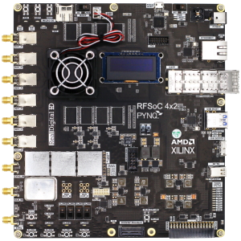

# New RFSoC 4x2

We are delighted to announce the launch of our new RFSoC 4x2 kits. The new kits greatly improve on
the performance of the older RFSoC 2x2 kits, at the same $2,149 academic price. 

Due to global supply challenges the [RFSoC 2x2  kits](rfsoc_2x2_overview.html) are discontinued but software support for existing boards will continue.

## Key features

* New **Gen 3** Zynq UltraScale+ RFSoC ZU48DR
* Faster **5GSPS** ADCs and **9.85GSPS** DACs
* Higher resolution **14-bit** ADCs
* Maximum RF input frequency increased to 6 GHz
* **Two** additional ADCs (four in total)
* New **high-speed QSFP28** interface supporting 4x25Gbps, 2x50Gbps or 1x100Gbps Ethernet 
* New **OLED** display for improved boot-time status
* New battery-backed **real-time clock**
* Upgraded open-source **Overlays** including **Spectrum Analyzer** design supporting higher RFSoC Gen 3 ADC/DAC frequencies and wider bandwidth

For more details and purchasing information see the [RFSoC 4x2 Overview](rfsoc_4x2_overview.html).

 

# RFSoC-PYNQ

RFSOC-PYNQ is an extension to [PYNQ](http://www.pynq.io/) bringing support for the AMD-Xilinx Zynq [RFSoC](https://www.xilinx.com/products/silicon-devices/soc/rfsoc.html) family of devices. RFSoC created a new class of integrated circuit architecture for the communications and instrumentation markets. RFSoCs combine high-accuracy ADCs and DACs operating at Giga samples per second (GSPS), with programmable heterogeneous compute engines.

RFSoC-PYNQ provides Python APIs, libraries and drivers for the RFSoC, example overlays and designs, tutorials and other resources for RFSoC users. 

 

# RFSoC-PYNQ features

* [PYNQ framework](http://www.pynq.io) with Jupyter Lab for exceptional ease-of-use
* *Python APIs* for RFSoC clock and data converters 
* Support for RFSoC Gen 1, Gen 2 and Gen 3 devices including the [AMD University Program RFSoC 4x2](rfsoc4x2.html)
* Complete end-to-end reference designs including spectrum analyzers and software defined radios (see [Overlays](overlays.html))
* Open-source [educational resources](educational_resources.html) including teaching materials, notebooks, and design examples
* [GitHub-hosted repositories](https://github.com/Xilinx/RFSoC4x2-PYNQ) of all project materials
  
The [RFSoC 4x2](rfsoc_4x2_overview.html) is the recommended kit to get started using RFSoC-PYNQ.

# Support 

See the [PYNQ community Support forum](https://discuss.pynq.io/) for discussion and to post support questions related to RFSoC-PYNQ. 

For other enquiries [contact the AMD Xilinx University Program](xup@xilinx.com).
