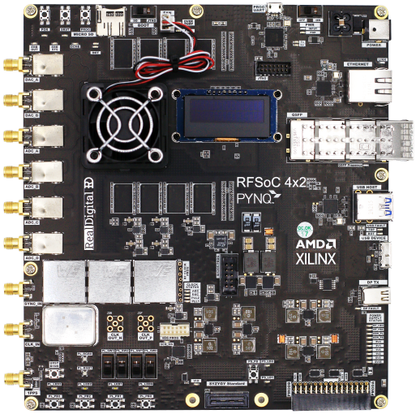

# RFSoC 4x2 kit

AMD-Xilinx’s Radio Frequency System-on-Chip ([RFSoC](https://www.xilinx.com/products/silicon-devices/soc/rfsoc.html)) devices have created a new class of integrated circuit architecture for the communications and instrumentation markets. RFSoCs combine high-accuracy ADCs and DACs operating at Giga samples per second (Gsps), with programmable heterogeneous compute engines.

The *RFSoC 4x2 kit* is based on the Xilinx RFSoC **Gen3 XCZU48DR**. The RFSoC 4x2 is an upgraded version of the earlier RFSoC 2x2 which was based on a RFSoC Gen1. If you are looking for information related to the earlier board, see the [RFSoC 2x2 webpages](https://xilinx.github.io/rfsoc2x2-pynq).

The RFSoC 4x2 kit will initially be available to academic customers only. For other enquiries [contact the AMD (Xilinx) University Program](xup@xilinx.com)

The kit features:

* RFSoC RFSoC 4x2 board with 4x 5GSPS RF ADC and 2x 9.85GSPS RF DAC channels
* [PYNQ framework](http://www.pynq.io) with Jupyter Lab for exceptional ease-of-use 
* Open-source resources including teaching materials, notebooks, and design examples  (see [Educational resources](./educational_resources.html))
* Complete end-to-end reference designs including spectrum analyzers and software defined radios (see [Overlays](overlays.html))
* [GitHub-hosted repositories](https://github.com/Xilinx/RFSoC4x2-PYNQ) of all project materials
* Online [PYNQ community support forum](https://discuss.pynq.io/)

For more details on the RFSoC 4x2 hardware, see the [Board Overview](overview.md) page.

## Purchase

* Academic price: $2,149

See the [XUP RFSoC 4x2 page](https://www.xilinx.com/support/university/xup-boards/RFSoC4x2.html) for details on how to apply to purchase an RFSoC 4x2.

## Getting started

If you already have a board, go to the [RFSoC 4x2 Getting Started](./getting_started.md) guide. The getting started guide includes instructions and a video showing you how to setup your board to run PYNQ.

## RFSoC 4x2 overlays and educational resources

Once your board is up and running, go to the [RFSoC 4x2 Overlays](./overlays.md) page for details about what you can do with your board, and how to build your own designs.

Review the [Educational resources](./educational_resources.html) and view the archived material including video and pdf presentations from the [ISFPGA 2021 RFSoC 4x2 tutorial](./tutorial.html).

## PYNQ community

For more information on what you can do with PYNQ, see the [PYNQ community](http://www.pynq.io/community.html) pages which showcases example PYNQ designs. You can check for any overlays that support the RFSoC 4x2, or try to port existing designs to your board.

