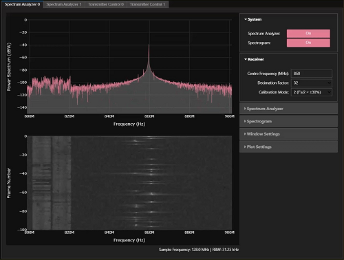
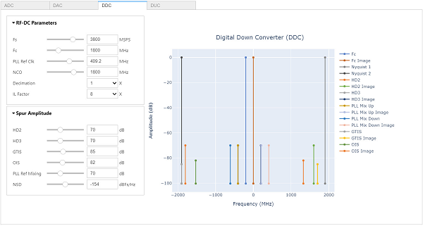
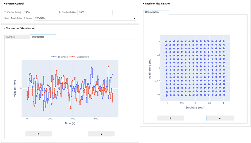
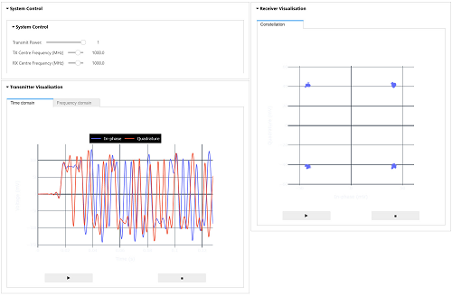
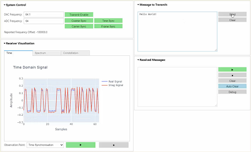
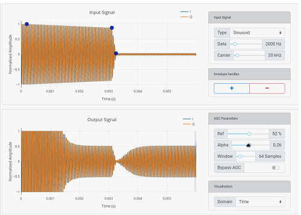

# RFSoC-PYNQ overlays

Most of the overlays on this page support the RFSoC 2x2, RFSoC 4x2, ZCU111, and ZCU208. Check each overlay for details. The designs are open source and can be ported to other suitable Zynq Ultrascale+ RFSoC boards. 

## Base Overlay

The `base` overlay is included in the PYNQ image and will be available for you to use from the first time you start your board.  The purpose of the base overlay design is to allow you to start exploring your board with PYNQ out-of-the-box. 

* [RFSoC 2x2 base overlay](./rfsoc_2x2_base_overlay.html) RFSoC Gen 1 with 2x ADC, 2x DAC
* [RFSoC 4x2 base overlay](./rfsoc_4x2_base_overlay.html) RFSoC Gen 3 with 4x ADC, 2x DAC, 100G CMAC

## Spectrum Analyzer

An RFSoC spectrum analysis tool is available on the RFSoC 2x2, RFSoC 4x2, ZCU111, and ZCU208 from the first time you start your board with the RFSoC-PYNQ. The spectrum analyzer was developed by the [University of Strathclyde](https://sdr.eee.strath.ac.uk/) Software Defined Radio (SDR) research laboratory. You can use the spectrum analyzer tool to explore your surrounding RF spectrum.

You can follow this [link to the RFSoC Spectrum Analyzer GitHub page](https://github.com/strath-sdr/rfsoc_sam), where you can update your spectrum analyzer tool, contribute to the project, or post questions and feedback using the issue tracker.

## RFSoC Frequency Planner

An RFSoC frequency planning tool created using Python is available to download and install on your RFSoC-PYNQ development board. This frequency planning tool is based on the original RFSoC frequency planner that can be downloaded [here](https://www.xilinx.com/publications/products/tools/zynq-ultrascale-plus-rfsoc-frequency-planner-rev1p7.xlsx.zip).

The Python based frequency planner uses widgets that allow the user to dynamically change system properties. You can follow this [link to the RFSoC Frequency Planner GitHub page](https://github.com/strath-sdr/rfsoc_frequency_planner), where you can download the frequency planner tool, contribute to the project, or post questions and feedback using the issue tracker.

## RFSoC OFDM Demonstrator

This overlay demonstrates the implementation of an Orthogonal Frequency Division Multiplexing (OFDM) transceiver on the RFSoC-PYNQ board. PYNQ is used to control the underlying modulation scheme of the OFDM sub-carriers and for visualisation of data at various stages in the transmit/receive chain, such as the received constellations.

The OFDM demonstrator can transmit and receive up to 1024-QAM. You can follow this [link to the RFSoC OFDM demonstrator GitHub page](https://github.com/strath-sdr/rfsoc_ofdm), where you can download and contribute to the project, or post questions and feedback using the issue tracker.

## RFSoC QPSK Demonstrator

The QPSK demonstrator was the first University of Strathclyde RFSoC introspection system. The design is a full QPSK transceiver, which transmits and receives randomly-generated pulse-shaped symbols with full carrier and timing synchronisation. PYNQ is used to visualise the data at both the RF DAC and RF ADC, as well as visualising various DSP stages throughout the transmit and receive signal path.

The QPSK and PYNQ design has since been published in [IEEE Access](https://ieeexplore.ieee.org/document/9139483). You can download and contribute to the project, or post questions and feedback from the GitHub repository, [RFSoC QPSK Demonstrator](https://github.com/strath-sdr/rfsoc_qpsk).

## RFSoC BPSK Demonstrator

This overlay presents a BPSK transceiver radio design for RFSoC platforms. The radio is capable of transmitting and receiving BPSK modulated waveforms in loopback, or between RFSoC development boards running the same design. A simple "hello world" example is presented demonstrating that transmitted BPSK waveforms can be received, synchronised, and the payload extracted for analysis.

You can download and contribute to this project, or post questions and feedback from the GitHub repository, [RFSoC BPSK Radio Demonstrator](https://github.com/strath-sdr/rfsoc_radio).

## A PYNQ AGC Design

This GitHub repository presents a digital Automatic Gain Control (AGC) circuit with interactive control of it's parameters. The system can generate various input signals, and allow you to explore some interesting effects of the AGC algorithm, and practice tweaking parameters for optimal performance.

You can download and contribute to this project, or post questions and feedback from the GitHub repository, [PYNQ AGC Demonstration](https://github.com/strath-sdr/pynq_agc).

## The RFSoC Studio Installer

The [University of Strathclyde](https://sdr.eee.strath.ac.uk/) SDR research laboratory has created a series of demonstration projects for RFSoC-PYNQ development board, many of these have been introduced above. You can obtain all of the above demonstrations using one installation command by navigating to the [RFSoC Studio](https://github.com/strath-sdr/rfsoc_studio) repository and following the instructions provided in the readme.
