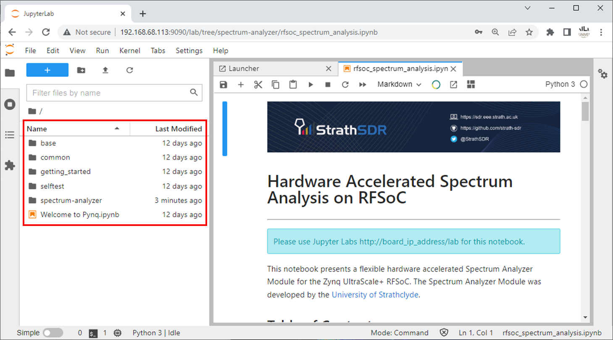

# Getting started with your RFSoC 2x2

This guide will show you how to setup your computer and RFSoC 2x2 board using PYNQ. 

### Prerequisites

* RFSoC 2x2 board
* Micro SD card (16GB or more recommended)
* Micro USB 3.0 Cable  
* Power supply for RFSoC 2x2 board

Optional: 

* Micro USB (2.0) cable (for serial terminal)
* Optional: Ethernet cable (for use instead of USB "Ethernet Gadget")

## Setup video

You can watch the getting started video guide or follow the instructions below. If you have any problems getting started, post a question to the [PYNQ support forum](https://discuss.pynq.io).

<iframe class="you-container" src="https://www.youtube.com/embed/HMbYNFAhBY4" title="YouTube video player" frameborder="0" allow="accelerometer; autoplay; clipboard-write; encrypted-media; gyroscope; picture-in-picture" allowfullscreen></iframe>

## Setup instructions

### Recommended: Update the Micro SD card with the latest PYNQ image

Your board comes with a Micro SD card, preloaded with a PYNQ image. An updated PYNQ image may be available. 

* Download the [RFSoC 2x2 latest PYNQ image](http://www.pynq.io/board.html) and write the image to a Micro SD card

See the PYNQ documentation on [writing an image to an SD card](https://pynq.readthedocs.io/en/latest/appendix.html#writing-the-sd-card-image) for more information. 

### Setup the board

Check the following steps to setup the board. 

1. Connect pins 1 & 2 on jumper JP1/JTAG to configure the board to boot from SD Card.
2. Connect the Micro USB cable from your computer to the USB 3.0 Composite port of your board.
3. Insert the Micro SD card (pre-loaded with the RFSoC 2x2 PYNQ image), and plug in the power cable.
4. Slide power switch up to turn on the board.

### PYNQ Boot sequence

After you power-on the board, you will see the following sequence:

1. The power status LEDs are on the right side of the board, near the power switch. After powering on the board, 11 out of the 12 power status LEDs will turn on. The only LED that will be off at boot is the "SYZYGY" LED (second from bottom labelled D46).  

   You may see other LEDs turn on or flash occasionally during boot. E.g. the Ethernet LEDs will flash.

2. After about 40 seconds, you will see the **DONE** and **INIT** LEDs near the top left of the board turn on. The *DONE* LED turning on indicates a bitstream has been downloaded to the programmable logic and is a good indication that the boot is progressing correctly. 

3. A few seconds later, the 4 white *user LEDs* (LED0-LED3) on the bottom center of the board will flash briefly and remain on. 

   You can now connect to the board.

See the [Troubleshooting section for issues](support.md#troubleshooting), or post questions to the [PYNQ support forum](https://discuss.pynq.io/).

#### Connect to the board

* On your computer, open a web browser. Chrome/Safari/Firefox are recommended for use with Jupyter Lab.

* Browse to [http://192.168.3.1/lab](http://192.168.3.1/lab)

The Jupyter Lab log-in screen will load.

* Enter **xilinx** as the password and click **Log in**

You are now in the Jupyter Lab IDE and the PYNQ framework. Use the example notebooks included with PYNQ to start exploring the RFSoC 2x2.

## Accessories

You can find a list of [accessories](accessories.html) that you can use with your board. 

## Next steps

Review the [overlays](./overlays.html) page for details on available overlays that can be used with your board. Overlays are prepacked PYNQ designs that you can use with your board. 
