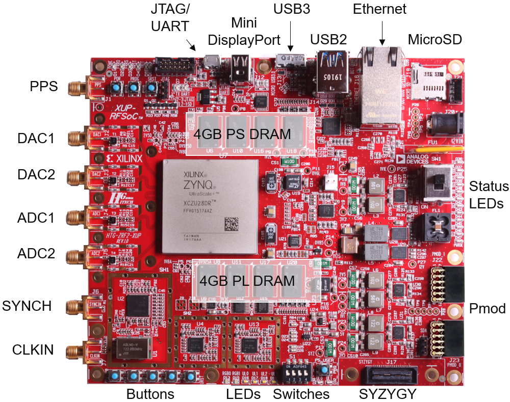
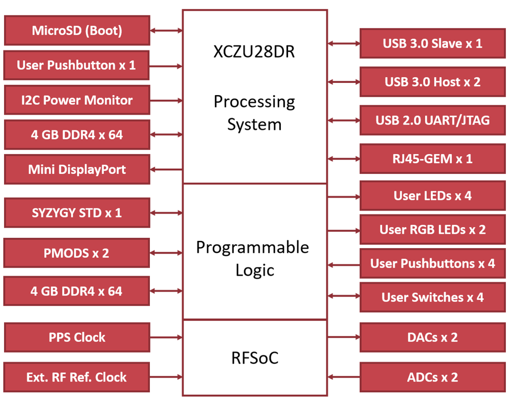

# RFSoC 2x2

 
Warning
 

 The RFSoC 2x2 has been discontinued. 
The <a href="rfsoc_4x2_overview.html">RFSoC 4x2</a> is the recommended replacement.

# RFSoC 2x2 Overview

The *RFSoC 2x2* was developed by the PYNQ team in partnership with HTG. The board is based on the Zynq Ultrascale+ RFSoC Gen 1 XCZU28DR and is  intended for academic teaching and research.

## Quick links

* If you have a board, follow the [RFSoC 2x2 getting started guide](rfsoc_2x2_getting_started.html)
* Download the [RFSoC 2x2 PYNQ image](http://www.pynq.io/board.html)
* [RFSoC 2x2 User Guide](./pdf/HTG-ZRF8_UG.pdf)
* [RFSoC 2x2 Schematic](./pdf/HTG-ZRF2-XUP_REV_11_Schematic_20Jan21.pdf)

# Zynq RFSoC device

The *RFSoC 2x2* has a Zynq Ultrascale+ XCZU28DR-FFVG1517AAZ with an Quad-core ARM Cortex A53 Processing System (PS) and Xilinx Ultrascale+ Programmable Logic (PL). The XCZU28DR has 8x RF ADC 8x DACs. The RFsoC 2x2 board has 2x RF ADCs (4.096 GSPS) and 2x RF DACs (6.554 GSPS) available via SMA connectors. 

There are BALUNs between the SMA connectors and the Zynq RFSoC on the board, which means that antenna and external signal sources can be connected directly to the board. 

# Board Overview

# PS/PL connections

## PS connected

* 4GB DDR4
* Micro SD card port
* Mini Display port
* Ethernet (RJ45)
* Stacked 2-port USB host
* USB 3.0 Composite device (Micro USB 3.0 port)
* UART/JTAG (Micro USB port)
* 1x User pushbutton
* I2C power monitor

## PL connected

* 2x RF DAC (6.554 GSPS)
* 2x RF ADC (4.096 GSPS)
* PPS clock & external reference clock
* 4GB DDR4
* SYZYGY port
* 2x PMOD
* 4x Switches, 5x User pushbuttons, 4x white user LEDs, 2x RGB LEDs   

## Block Diagram

# Next steps

Follow the [RFSoC 2x2 getting started guide](rfsoc_2x2_getting_started.html) to set up and start using your board.

