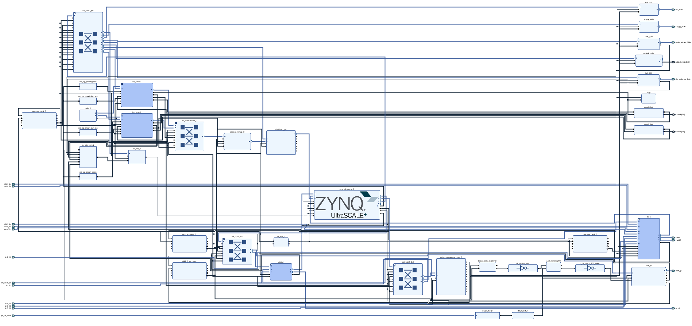
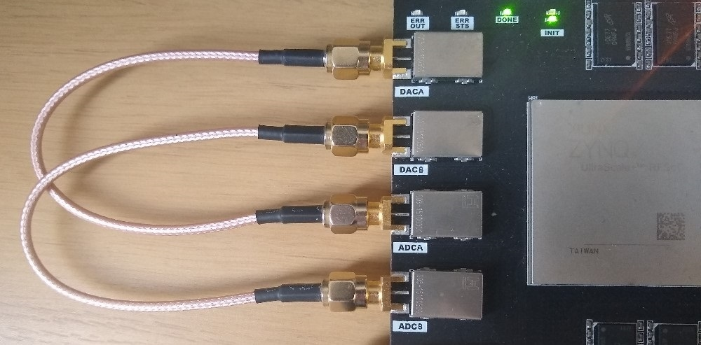
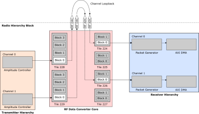
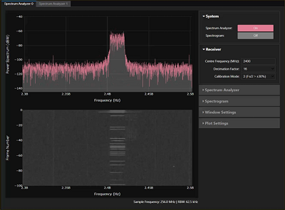
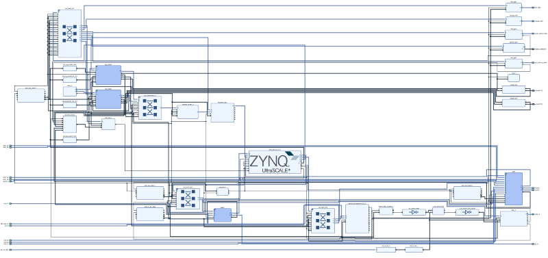

# RFSoC 4x2 Base overlay

The `base` overlay is included in the PYNQ image for the  RFSoC 4x2 board. The purpose of the base overlay design is to allow you to get start using your board with PYNQ out-of-the-box. The base design includes a bitstream with IP to allow you to start using the RF ADCs and DACs on the board. The other main blocks are the memory controller for the PL DRAM, two PYNQ PMOD IOPs to connect to Pmod™ ports, AXI GPIO controllers, an interrupt block, and a system monitor. 

## Block Diagram

All IP are connected to the PS, and controllable from PYNQ. AXI GPIO controllers are connected to the RGB LEDs and white user LEDs, buttons and switches. The SYZYGY port is also connected to an AXI GPIO controller. An interrupt controller All these IP blocks are connected to the PS and are controllable from PYNQ. 



The PL DRAM is mapped to the PS memory map, effectively extending the amount of DRAM available to the PS. This is only intended as a simple example showing how to configure the IP for the PL DRAM. As this DRAM controller is in the PL, it will be slower to access this memory than the PS attached DRAM. It is likely in your own designs that you will make a direct connection from IP in your design to the PL DRAM.  

The SYZYGY port is connected to a simple AXI GPIO controller connected to the PS. This allows you to interact with the SYZYGY port in a very simple way using the PYNQ AXI GPIO class (which uses PYNQ MMIO). For your own designs, you will likely add your own custom IP to control the SYZYGY peripheral you are using. 


## Notebook/Python API

Example notebooks are also provided on the board to show you how to use the base overlay.

### Common notebooks

The *common* notebooks folder contains generic notebooks that can run on most PYNQ boards, or notebooks that do not depend on IP in the PL. The common folder for the RFSoC 4x2 includes notebooks for downloading an Overlay (bitstream), and controlling the PS to PL clocks, controlling the DisplayPort, running shell commands in a notebook, power measurement with PMBus and using a USB webcam, and configuring WiFi.

### Base Notebooks

Contains notebooks specific to the *base* overlay for the RFSoC 4x2

#### RFDC (RF Data Converters) notebooks

The RFDC folder contains notebooks to interact with the *Radio* IP subsystem in the *base* overlay and allows you to control the RF Data Converters. 

The three notebooks are numbered, and you should try run them in order: 

* 01_rf_dataconverter_introduction.ipynb
* 02_rf_spectrum_analysis.ipynb
* 03_rf_spectrum_sweep.ipynb

 <table>
<tr>
<td style="vertical-align:middle; background:transparent;"></td>
<td style="vertical-align:middle; background:transparent;"></td>
<td style="vertical-align:middle; background:transparent;"></td>
</tr>
<tr>
<td style="text-align:center; background:transparent;">Setup Board</td>
<td style="text-align:center; background:transparent;">System overview</td>
<td style="text-align:center; background:transparent;">Spectrum Analyzer</td>
</tr>
</table>

The notebooks cover an introduction to the RF Data Converters (RF DCs) on the RFSoC 4x2 board, RF board setup and a tutorial on inspecting and manipulating captured RF ADC data, and creating a Spectrum plot in PYNQ and how to perform a spectrum sweep. 

#### Board notebooks

The following notebooks are in the board directory:

* buttons_leds_switches.ipynb - simple example showing how to read/write GPIO LEDs, Buttons and Switches
* pl_ddr4.ipynb - example notebook showing how to read and write PL DRAM using the PYNQ MMIO class. 
* register_map_intro.ipynb - shows how to interact with the PYNQ IP register map
* syzygy_loopback.ipynb - shows how to interact with the SYZYGY interface on the board including how to set the voltage. Note that this API depends on the *base* overlay design, and the IP that connects to the SYZYGY interface. If you have your own custom design, you need to be careful when controlling the SYZYGY interface. If you want to use the same scheme in this notebook, you need to be careful that your hardware design for the SYZYGY controller matches the base overlay. 

#### MicroBlaze and Pmod

The *base* Overlay includes two Pmod IOPs. The MicroBlaze and Pmod folders contain notebooks showing how to use Pmods with PYNQ, and using the MicroBlaze processor inside the IOPs. These notebooks can be found on other PYNQ boards with Pmod IOPs. 

Refer to the [PYNQ Pmod IOP](https://pynq.readthedocs.io/en/latest/pynq_libraries/pmod.html) and [PYNQ MicroBlaze](https://pynq.readthedocs.io/en/latest/pynq_libraries.html#pynqmicroblaze) documentation for more details. 


## Rebuild the base overlay

The following steps describe how to rebuild the *base* overlay. As the precompiled design is already available in the PYNQ image for the board, you only need to do this if you want to study the design, or make a modification. 

### Get the source code

* Download or clone a copy of this repository

```sh
git clone https://github.com/Xilinx/RFSoC-PYNQ.git
```

## Create the Vivado project

The current `base` design was built using **Vivado 2022.1**. Other versions of Vivado are untested and are unlikely to build this design without modifications. 

You need to make sure you have included the RFSoC devices in your Vivado installation. If you didn't do this when you installed Vivado, you can add them from the Vivado *help* menu. 

### Linux

On Linux, make sure you have sourced your Xilinx tools and navigate to the `base` directory where you cloned this repository and run `make`.

```console
cd RFSoC-PYNQ/boards/RFSoC4x2/base/
make
```

This will build a Vivado project with the base design for the board. The make file automatically calls the Tcl files described in the Windows flow below. 

### Windows

* Open Vivado and use the TCL console to navigate to the `base` directory. 

```console
cd RFSoC-PYNQ/boards/RFSoC4x2/base/
```

Run the following command in order to create a Vivado project and build the block diagram for the base overlay:

```console
source ./base.tcl
```

This command:

1. Creates a Vivado project named `base`
1. Sets the RFSoC part
1. Builds the IP Integrator system diagram for the base overlay. 

You can now review the block diagram, which should look similar to the image below. Click the image to view a pdf of the design.

[](./pdf/rfsoc_4x2_base_overlay.pdf)

You can run the following commands to rebuild the bitstream.

```console
close_project
source ./build_bitstream.tcl
```

This command:

1. Creates the HDL wrapper for the block design
1. Adds the constraint file (.xdc)
1. Sets platform properties 
1. Launches the process to generate the bitstream

The bitstream file and HWH file will be copied to the top level of your project directory. 

Remember the precompiled bitstream and HWH are already loaded on your board. You do not need to rebuild the bitstream unless you have changed something in the design. 
