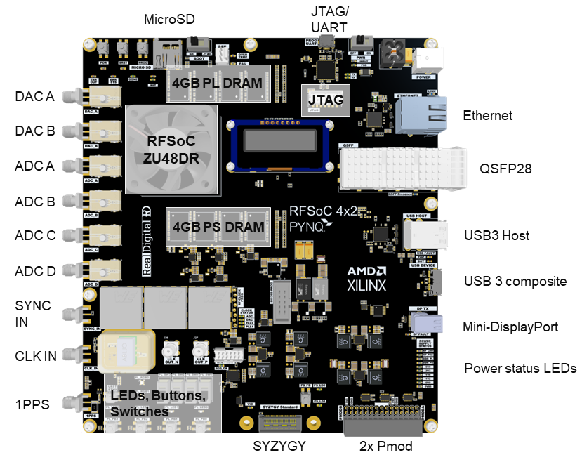
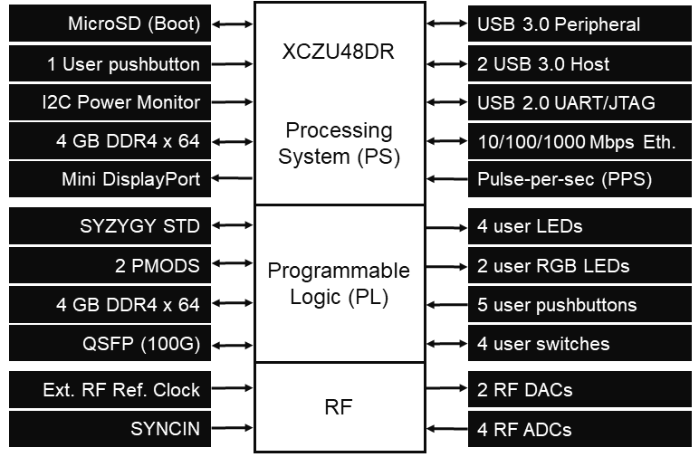

## RFSoC 4x2 Overview

The *RFSoC 4x2* is developed by the PYNQ team in partnership with [Real Digital](https://www.realdigital.org/). The board is based on the Zynq Ultrascale+ RFSoC Gen 3 ZU48DR.

### Purchase

The RFSOC 4x2 is currently only available to Universities and Research Institutes. 

* Academic price: $2149

To purchase a board, [submit a request to the AMD University Program](https://www.amd.com/en/corporate/university-program/aup-boards/rfsoc4x2.html#Purchasing_at_academic_price). 

For enquiries [contact the AMD University Program](mailto:aup@amd.com)

## Quick links

* If you have a board, follow the [RFSoC 4x2 getting started guide](rfsoc_4x2_getting_started.html)
* Download the latest [RFSoC 4x2 PYNQ image](http://www.pynq.io/board.html)
* Go to the [Real Digital RFSoC 4x2](https://www.realdigital.org/hardware/rfsoc-4x2) webpage to download the user manual, schematics, Board Support Package (BSP), Vivado constraints files and other board resources.

## Zynq RFSoC device

The *RFSoC 4x2* has a Zynq Ultrascale+ RFSoC XCZU48DR-1FFVG1517E with a Quad-core ARM Cortex A53 Processing System (PS) and Xilinx Ultrascale+ Programmable Logic (PL). The XCZU48DR has 8x RF ADC 8x DACs. The RFsoC 4x2 board has 4x RF ADCs (5 GSPS) and 2x RF DACs (9.85 GSPS) available via SMA connectors with integrated baluns. This means antenna and external signal sources can be connected directly to the board.

## Board Overview

## PS/PL connections

### PS connected

* 4GB DDR4
* Micro SD card port
* Mini Display port
* Ethernet (RJ45)
* Stacked 2-port USB 3.0 host
* USB 3.0 Composite device (Micro USB 3.0 port)
* UART/JTAG (Micro USB 2.0 port)
* 1x User push button
* 2x User LEDs
* I2C power monitor

### PL connected

* 2x RF DAC (9.85 GSPS)
* 4x RF ADC (5 GSPS)
* 1x QSFP28 (supports 4x25Gbps, 2x50Gbps or 1x100Gbps Ethernet)
* PPS clock & external reference clock
* 4GB DDR4
* SYZYGY STD port
* 30 Pin header
  * Configure as 2x PMOD or 22 GPIO with 4x VCC and 2x GND
* 4x Switches, 5x User push buttons, 4x white user LEDs, 2x RGB LEDs

### Block Diagram

## Open-source hardware

The board has been developed with open source in mind. The schematics, bill of materials, and the PCB Gerber files are available open-source. This will enable
research teams, for example, to use the RFSoC 4x2 as the starting point for developing custom boards which they may require in their specific research experiments.

Most supporting files for the board are available for download on the [Real Digital RFSoC 4x2 page](https://www.realdigital.org/hardware/rfsoc-4x2). Due to the size of the Gerber files (several 10's GB) please contact [aup@amd.com](mailto:aup@amd.com) if you require the PCB Gerber files.

## Next steps

Follow the [RFSoC 4x2 getting started guide](rfsoc_4x2_getting_started.html) to set up and start using your board.
